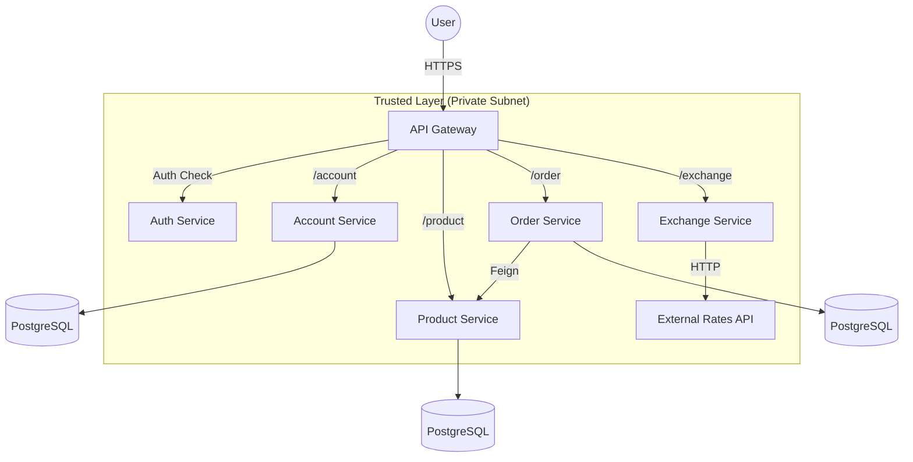

# Microservices Architecture Example Store

[](https://www.java.com/)
[](https://spring.io/projects/spring-boot)
[](https://www.python.org/)
[](https://fastapi.tiangolo.com/)
[](https://www.docker.com/)
[](https://kubernetes.io/)
[](https://aws.amazon.com/)

A high-performance, polyglot microservices architecture for a modern e-commerce backend. Designed with scalability, security, and maintainability in mind, this project demonstrates a production-ready implementation of the **Database-per-Service** pattern.

[📚 **Read the Full Documentation**](https://microservices-architecture-example.github.io/)

---

## 🚀 Architecture Overview

The system is composed of loosely coupled services communicating via REST APIs, with a centralized **API Gateway** handling routing and security.



## 🛠️ Services

| Service | Tech Stack | Description |
| :--- | :--- | :--- |
| **Gateway** | Java, Spring Cloud Gateway | Edge server acting as the single entry point. Handles **JWT validation**, **CORS**, and **Rate Limiting**. |
| **Auth** | Java, Spring Boot, JWT | Centralized identity provider. Issues **HMAC256** signed tokens. |
| **Account** | Java, Spring Boot | Manages user profiles and authentication data. |
| **Product** | Java, Spring Boot | Product catalog management with **Flyway** migrations. |
| **Order** | Java, Spring Boot | Orchestrates order processing, validating stock and calculating totals via inter-service communication. |
| **Exchange** | **Python, FastAPI** | Real-time currency conversion service, demonstrating a **polyglot architecture**. |

## ✨ Key Features

*   **Polyglot Architecture**: Seamless integration of Java (Spring Boot) and Python (FastAPI) services.
*   **Centralized Security**: Stateless authentication using JWT, enforced at the Gateway level.
*   **Infrastructure as Code**: Fully containerized with Docker and orchestrated via Kubernetes (EKS).
*   **CI/CD**: Automated pipelines using Jenkins and GitHub Actions.
*   **Database Isolation**: Each service owns its data schema, ensuring loose coupling.

---

## 📦 Documentation Setup

This repository contains the source code for the project documentation, built with **MkDocs**.

### Prerequisites
*   Python 3.10+

### Running Locally

1.  Create a virtual environment:
    ```shell
    python3 -m venv env
    source ./env/bin/activate
    ```

2.  Install dependencies:
    ```shell
    python3 -m pip install -r requirements.txt --upgrade
    ```

3.  Start the development server:
    ```shell
    mkdocs serve
    ```

4.  Access the docs at `http://127.0.0.1:8000`.