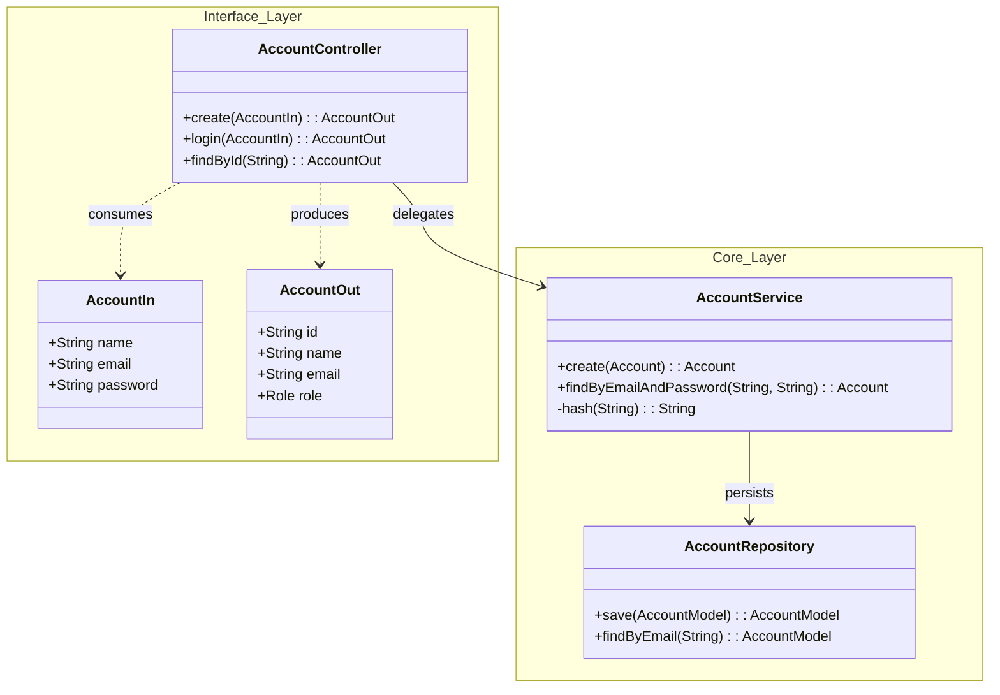

# Account Service

The **Account Service** is the backbone of user management within the `store` domain. It handles user registration, authentication credentials, and profile management. It serves as the foundation for the authentication process and establishes relationships with other services (e.g., associating orders with users).

!!! info "Security & Trusted Layer"
    This service sits behind the **API Gateway**.
    *   **External Access**: All external requests must pass through the Gateway.
    *   **Protection**: Routes under `/account/**` are protected and require a valid JWT in the `Authorization` header (except for registration and login).

---

## 🏗️ Architecture

The service follows a clean layered architecture, separating the API interface from the core business logic and persistence.



---

## 🔌 API Reference

The service exposes a RESTful API for account management.

### Endpoints

| Method | Path | Description | Auth Required |
| :--- | :--- | :--- | :--- |
| `POST` | `/account` | Register a new user account. | ❌ No |
| `POST` | `/account/login` | Authenticate user credentials. | ❌ No |
| `GET` | `/account/{id}` | Retrieve account details by ID. | ✅ Yes |
| `GET` | `/account` | List all accounts (Admin use). | ✅ Yes |
| `DELETE` | `/account/{id}` | Delete an account. | ✅ Yes |
| `GET` | `/account/whoami` | Retrieve current user details based on headers. | ✅ Yes |

### Data Models

#### `AccountIn` (Input)
Used for registration and login.
```json
{
  "name": "John Doe",
  "email": "john@example.com",
  "password": "secretpassword"
}
```

#### `AccountOut` (Output)
Safe representation of the user account (no sensitive data).
```json
{
  "id": "550e8400-e29b-41d4-a716-446655440000",
  "name": "John Doe",
  "email": "john@example.com",
  "role": "USER"
}
```

---

## 🧠 Business Logic

The `AccountService` implements critical business rules to ensure data integrity and security.

### 1. Validation
*   **Password**: Must be at least **4 characters** long (after trimming).
*   **Email**: Mandatory and must be **unique** in the system.
*   **Role**: New accounts are assigned the `USER` role by default.

### 2. Security (Password Hashing)
Passwords are **never** stored in plain text. The service uses **SHA-256** hashing before persistence.

```java
// Snippet from AccountService.java
private String hash(String pass) {
    try {
        MessageDigest digest = MessageDigest.getInstance("SHA-256");
        byte[] encodedHash = digest.digest(
            pass.getBytes(StandardCharsets.UTF_8)
        );
        return Base64.getEncoder().encodeToString(encodedHash);
    } catch (NoSuchAlgorithmException e) {
        throw new ResponseStatusException(HttpStatus.INTERNAL_SERVER_ERROR, e.getMessage(), e);
    }
}
```

---

## 💾 Database Schema

The service uses **PostgreSQL** for persistence. Database migrations are managed by **Flyway**.

### Table: `account`

| Column | Type | Constraints | Description |
| :--- | :--- | :--- | :--- |
| `id` | `VARCHAR` | `PRIMARY KEY` | Unique UUID. |
| `name` | `VARCHAR` | `NOT NULL` | User's full name. |
| `email` | `VARCHAR` | `UNIQUE`, `NOT NULL` | User's email address. |
| `sha256` | `VARCHAR` | `NOT NULL` | Hashed password. |
| `role` | `VARCHAR` | `DEFAULT 'USER'` | User role (USER, ADMIN). |

### Migrations
*   `V2025.08.29.001__create_schema.sql`: Initializes the schema.
*   `V2025.08.29.002__create_table_account.sql`: Creates the account table.
*   `V2025.09.02.001__create_index_email.sql`: Adds index for fast email lookups.

---

## ⚙️ Configuration

The service is configured via `application.yml`. Key settings include:

```yaml
spring:
  application:
    name: account
  datasource:
    url: ${DATABASE_URL} # Injected via environment variable
    username: ${DATABASE_USER:store}
    password: ${DATABASE_PASSWORD:I5pEr@5ecReT}
  flyway:
    baseline-on-migrate: true
    schemas: account
```

---

## 📂 Project Structure

The project is split into two modules:

1.  **Interface (`account`)**: Contains the DTOs and Feign Client. This is a library used by other services to communicate with the Account Service.
2.  **Implementation (`account.service`)**: The actual Spring Boot application.

```tree
api/
├── account/                # Interface Module
│   ├── src/main/java/store/account/
│   │   ├── AccountController.java  # Feign Client Interface
│   │   ├── AccountIn.java          # Input DTO
│   │   └── AccountOut.java         # Output DTO
│   └── pom.xml
│
└── account.service/        # Implementation Module
    ├── src/main/java/store/account/
    │   ├── AccountService.java     # Business Logic
    │   ├── AccountResource.java    # REST Controller Implementation
    │   └── AccountRepository.java  # JPA Repository
    ├── src/main/resources/
    │   ├── db/migration/           # Flyway SQL Scripts
    │   └── application.yml         # Config
    ├── Dockerfile
    └── k8s/                        # Kubernetes Manifests
```