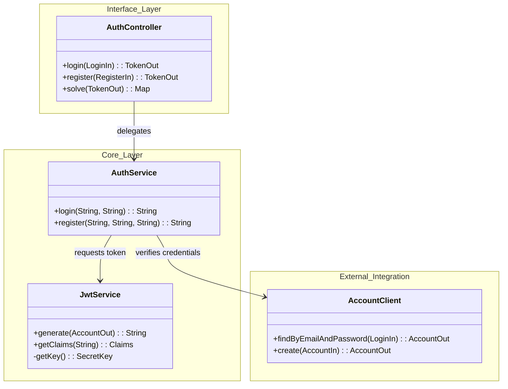
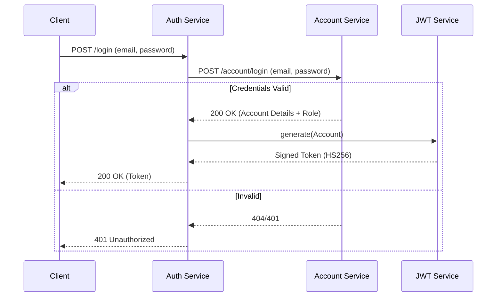

# Auth Service

The **Auth Service** is the security cornerstone of the `store` domain. It is responsible for validating user credentials and issuing **JSON Web Tokens (JWT)**. These tokens are the "keys" that allow users to access protected resources across all other microservices.

!!! info "Security & Trusted Layer"
    *   **Gateway Integration**: The API Gateway delegates authentication to this service.
    *   **Statelessness**: The service is stateless; it does not store sessions. Trust is established via the cryptographic signature of the JWT.

---

## 🏗️ Architecture

The service orchestrates the login flow by verifying credentials against the **Account Service** and then using its internal **JWT Service** to sign tokens.



---

## 🔌 API Reference

The API is primarily used for obtaining access tokens.

### Endpoints

| Method | Path | Description | Auth Required |
| :--- | :--- | :--- | :--- |
| `POST` | `/auth/login` | Authenticate with email/password and receive a JWT. | ❌ No |
| `POST` | `/auth/register` | Create a new account and receive a JWT (Proxy to Account Service). | ❌ No |
| `POST` | `/auth/solve` | Validate a token and extract claims (Internal use). | ❌ No |

### Data Models

#### `LoginIn`
```json
{
  "email": "john@example.com",
  "password": "secretpassword"
}
```

#### `TokenOut`
```json
{
  "token": "eyJhbGciOiJIUzI1NiJ9.eyJzdWIiOiJKb2huIERvZSIsIm..."
}
```

---

## 🔐 Security Flow

The authentication process involves a secure handshake between the Auth Service and the Account Service.



---

## 🔑 JWT Implementation Details

The `JwtService` handles the cryptographic operations.

### Configuration
*   **Algorithm**: `HMAC256` (HS256).
*   **Expiration**: **2 hours** (120 minutes).
*   **Issuer**: `Insper::PMA`.

### Token Structure (Claims)
The generated token contains the following claims:

| Claim | Key | Description |
| :--- | :--- | :--- |
| **Subject** | `sub` | User's Name. |
| **ID** | `jti` | User's UUID (from Account Service). |
| **Issuer** | `iss` | `Insper::PMA`. |
| **Role** | `role` | User's Role (e.g., `USER`, `ADMIN`). |
| **Email** | `email` | User's Email. |

### Code Snippet: Token Generation
```java
// Snippet from JwtService.java
public String generate(AccountOut account) {
    Date now = new Date();
    return Jwts.builder()
        .header().and()
        .id(account.id())
        .issuer("Insper::PMA")
        .claims(Map.of(
            "email", account.email(),
            "role", account.role()
        ))
        .signWith(getKey()) // HMAC-SHA Key
        .subject(account.name())
        .notBefore(now)
        .expiration(new Date(now.getTime() + 1000 * 60 * 120)) // 2 hours
        .compact();
}
```

---

## ⚙️ Configuration

The service is configured via `application.yaml`.

```yaml
store:
  jwt:
    # The secret key used to sign tokens. 
    # In production, this is injected via environment variables.
    secretKey: ${JWT_SECRET_KEY:changeit}
```

---

## 📂 Project Structure

The project follows the standard Interface/Implementation split:

1.  **Interface (`auth`)**: Contains DTOs and the Feign Client interface.
2.  **Implementation (`auth.service`)**: The Spring Boot application containing the logic.

```tree
api/
├── auth/                   # Interface Module
│   ├── src/main/java/store/auth/
│   │   ├── AuthController.java     # Feign Interface
│   │   ├── LoginIn.java            # DTO
│   │   ├── RegisterIn.java         # DTO
│   │   └── TokenOut.java           # DTO
│   └── pom.xml
│
└── auth.service/           # Implementation Module
    ├── src/main/java/store/auth/
    │   ├── AuthService.java        # Orchestration Logic
    │   ├── JwtService.java         # JWT Signing/Parsing
    │   └── AuthResource.java       # REST Controller
    ├── src/main/resources/
    │   └── application.yaml        # Config
    ├── Dockerfile
    └── k8s/                        # Kubernetes Manifests
```