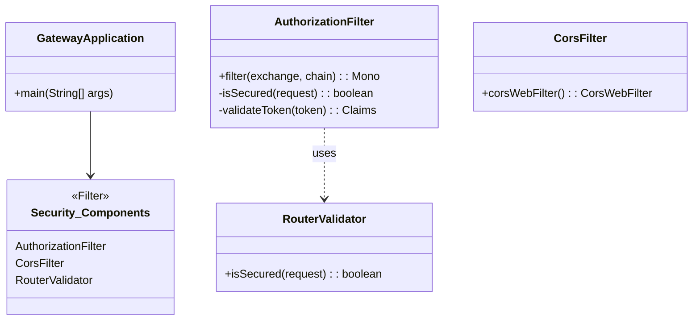
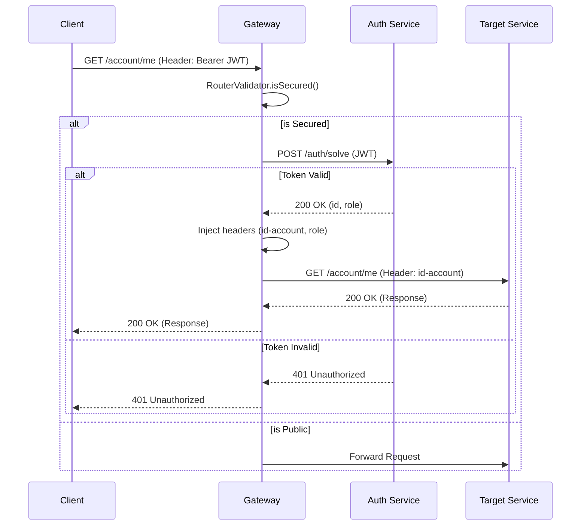

# Gateway Service

The **Gateway Service** acts as the single entry point (Edge Server) for all external traffic entering the `store` domain. It is built on top of **Spring Cloud Gateway** and provides routing, security, and monitoring capabilities.

!!! info "Edge Server & Security"
    *   **Single Entry Point**: Clients only interact with the Gateway, never directly with internal microservices.
    *   **Security Enforcement**: It enforces authentication via JWT validation before routing requests to protected services.

---

## 🏗️ Architecture

The Gateway orchestrates the request flow through a series of filters.



---

## 🚦 Routing Configuration

Routes are defined in `application.yml`. The Gateway uses the `http://` protocol to route traffic to specific hostnames (which resolve to Kubernetes Services or Docker containers).

```yaml
spring:
  cloud:
    gateway:
      routes:
        - id: auth
          uri: http://auth:8080
          predicates:
            - Path=/auth/**
        
        - id: account
          uri: http://account:8080
          predicates:
            - Path=/account/**
            
        - id: order
          uri: http://order:8080
          predicates:
            - Path=/order/**
```

---

## 🔐 Security Pipeline

The Gateway implements a robust security pipeline to protect downstream services.

### 1. CORS Configuration (`CorsFilter`)
Handles Cross-Origin Resource Sharing to allow web clients to interact with the API.
*   **Allowed Origins**: `*` (All origins).
*   **Allowed Methods**: `*` (GET, POST, PUT, DELETE, etc.).

### 2. Route Validation (`RouterValidator`)
Determines if a request requires authentication.
*   **Public Endpoints**:
    *   `/auth/login`
    *   `/auth/register`
    *   `/auth/swagger-ui.html`
*   **Protected Endpoints**: All others.

### 3. Authorization (`AuthorizationFilter`)
This is the core security filter that executes for every protected request.

#### Logic Flow:
1.  **Check Header**: Verifies the presence of the `Authorization` header.
2.  **Extract Token**: Parses the `Bearer <token>` string.
3.  **Validate Token**: Calls the **Auth Service** (`/auth/solve`) to validate the signature and expiration.
4.  **Inject Identity**: If valid, it injects the `id-account` and `role-account` headers into the request.
5.  **Forward**: Passes the modified request to the downstream service.

```java
// Snippet from AuthorizationFilter.java
private Mono<Void> requestAuthTokenSolve(ServerWebExchange exchange, GatewayFilterChain chain, String jwt) {
    return webClient
        .post()
        .uri("http://auth:8080/auth/solve")
        .bodyValue(Map.of("jwt", jwt))
        .retrieve()
        .toEntity(Map.class)
        .flatMap(response -> {
            // ... extract accountId and role ...
            ServerWebExchange authorizated = updateRequest(exchange, accountId, role);
            return chain.filter(authorizated);
        });
}
```

---

## 🔄 Request Flow

The following sequence diagram illustrates the lifecycle of a request entering the Gateway.



---

## ⚙️ Configuration

The service is configured via `application.yml`.

```yaml
server:
  port: 8080

spring:
  application:
    name: gateway
  cloud:
    gateway:
      routes: [ ... ] # Route definitions

management:
  endpoints:
    web:
      exposure:
        include: [ 'prometheus', 'gateway' ] # Monitoring
```

---

## 📂 Project Structure

The project structure is focused on the Spring Cloud Gateway implementation.

```tree
api/
└── gateway.service/
    ├── src/main/java/store/gateway/
    │   ├── GatewayApplication.java     # Main Entry Point
    │   ├── GatewayResource.java        # Health Check
    │   └── security/
    │       ├── AuthorizationFilter.java # JWT Validation Logic
    │       ├── CorsFilter.java          # CORS Config
    │       └── RouterValidator.java     # Route Security Rules
    ├── src/main/resources/
    │   └── application.yaml            # Routes & Config
    ├── Dockerfile
    └── k8s/                            # Kubernetes Manifests
```