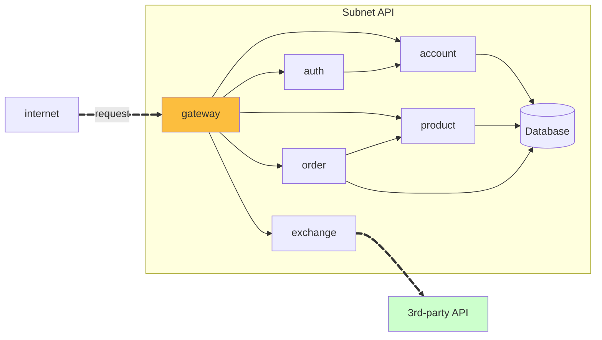

# Microservices Architecture Example

**A Cloud-Native E-Commerce Microservices Architecture built with Spring Boot and Kubernetes.**

This project is a practical and robust example of a microservices architecture, demonstrating how to build a scalable, resilient, and modern application. It serves as a reference for design patterns, system integration, and DevOps practices.

---

## 🚀 Tech Stack

This project leverages a modern stack focused on performance, scalability, and cloud-native deployment:

### Backend & Frameworks

### Data & Persistence

### DevOps & Cloud

---

## ☁️ AWS Integration

This architecture is designed to run natively on **Amazon Web Services (AWS)**, leveraging managed services for high availability and minimal operational overhead.

*   **EKS (Elastic Kubernetes Service)**: Orchestrates the microservices containers.
*   **ALB/NLB (Load Balancers)**: Manages external traffic ingress to the API Gateway.
*   **RDS (Relational Database Service)**: (Optional) Can be configured to host the PostgreSQL databases.
*   **ElastiCache**: (Optional) Managed Redis for caching.

---

## 🏗️ Architecture & Design

The architecture follows the **API Gateway** pattern with isolated databases per service (**Database per Service**), ensuring decoupling and autonomy.

### Component Diagram

### Services

The system is composed of the following microservices, each with a unique responsibility:

| Service | Responsibility | Interface | Implementation |
| :--- | :--- | :--- | :--- |
| **Gateway Service** | Single entry point, routing, and security. | - | [gateway-service](https://github.com/microservices-architecture-example/gateway.service) |
| **Auth Service** | Authentication and authorization (JWT). | [auth](https://github.com/microservices-architecture-example/auth) | [auth-service](https://github.com/microservices-architecture-example/auth.service) |
| **Account Service** | User and account management. | [account](https://github.com/microservices-architecture-example/account) | [account-service](https://github.com/microservices-architecture-example/account.service) |
| **Product Service** | Product catalog and management. | [product](https://github.com/microservices-architecture-example/product) | [product-service](https://github.com/microservices-architecture-example/product.service) |
| **Order Service** | Order management and purchase flow. | [order](https://github.com/microservices-architecture-example/order) | [order-service](https://github.com/microservices-architecture-example/order.service) |
| **Exchange Service** | Currency exchange rates (external integration). | - | [exchange-service](https://github.com/microservices-architecture-example/exchange.service) |

---

## 🌟 Key Features

*   **Secure Authentication**: Stateless implementation with JWT.
*   **Externalized Configuration**: Centralized configuration management.
*   **Resilience**: Fault tolerance patterns in inter-service communication.
*   **Automated CI/CD**: Build and deploy pipelines with Jenkins.
*   **Infrastructure as Code**: Organized Kubernetes manifests for EKS deployment.

---

## 🔗 Main Repository

To access the complete source code and service orchestration:
[**microservices-architecture-example/all**](https://github.com/microservices-architecture-example/all)