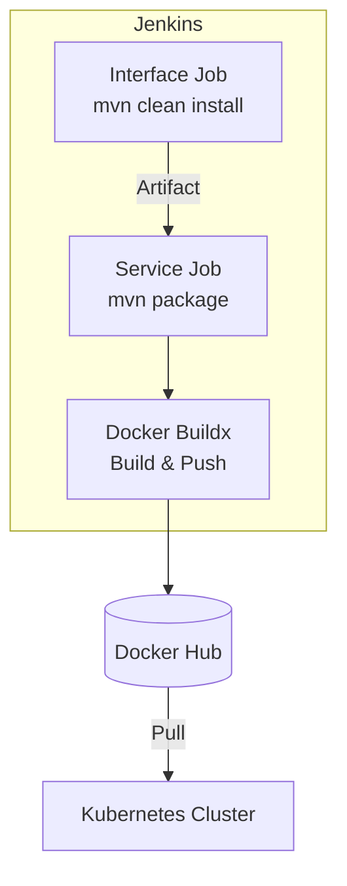

# Jenkins CI/CD Pipelines

The project's **Continuous Integration and Continuous Deployment (CI/CD)** workflow is orchestrated by **Jenkins**. The pipelines are designed to ensure code quality, automate testing, and streamline the delivery of Docker images to the registry.

## 🚀 Pipeline Strategy

There are **two distinct pipeline types** tailored to the component architecture:

### 1. Interface Pipelines
*(Applied to: `account`, `auth`, `product`, `order`)*
*   **Goal**: Publish shared artifacts (JARs/Contracts) for other modules to consume.
*   **Output**: Maven Artifacts (installed to local/remote repo).
*   **Steps**: `mvn clean install` (skipping tests for speed in this demo context).
*   **Docker**: ❌ No image generation.

### 2. Service Pipelines
*(Applied to: `*.service` modules)*
*   **Goal**: Deployable application artifacts.
*   **Output**: Multi-architecture Docker Images (`linux/amd64`, `linux/arm64`).
*   **Steps**:
    1.  **Dependencies**: Trigger upstream Interface jobs to ensure contracts are up-to-date.
    2.  **Build**: Compile the application (`mvn package`).
    3.  **Docker Build & Push**: Build and push images to Docker Hub using `buildx`.

---

## 📊 Build Status

The Jenkins dashboard provides a centralized view of all active pipelines, their health, and execution history.


---

## 🛠️ Pipeline Definitions

### Interface Pipeline (Maven Only)
Simple pipeline to compile and install the artifact.

```groovy
pipeline {
    agent any
    stages {
        stage('Build') {
            steps {
                sh 'mvn -B -DskipTests clean install'
            }
        }
    }
}
```

### Service Pipeline (Docker Build & Push)
Comprehensive pipeline handling dependencies, build, and multi-arch image publication.

```groovy
pipeline {
    agent any
    environment {
        SERVICE = "account-service" // Example
        NAME = "microservices-architecture-example/${env.SERVICE}"
    }
    stages {
        stage('Dependencies') {
            steps {
                // Ensure the Interface contract is built first
                build job: 'account', wait: true
            }
        }
        stage('Build') { 
            steps {
                sh 'mvn -B -DskipTests clean package'
            }
        }      
        stage('Build & Push Image') {
            steps {
                withCredentials([usernamePassword(
                    credentialsId: 'dockerhub-credential',
                    usernameVariable: 'USERNAME',
                    passwordVariable: 'TOKEN')]) {
                    
                    sh "docker login -u $USERNAME -p $TOKEN"

                    // Create ephemeral multi-arch builder
                    sh "docker buildx create --use --platform=linux/arm64,linux/amd64 --name builder-${env.SERVICE}"

                    // Build and Push tags: :latest and :BUILD_ID
                    sh "docker buildx build --platform=linux/arm64,linux/amd64 --push --tag ${env.NAME}:latest --tag ${env.NAME}:${env.BUILD_ID} -f Dockerfile ."

                    // Cleanup
                    sh "docker buildx rm --force builder-${env.SERVICE}"
                }
            }
        }
    }
}
```

---

## 🔄 Workflow Diagram



---

## 📂 Jenkinsfile Locations

The `Jenkinsfile` for each component is located in its respective source repository. You can view the specific configuration in the API documentation:

| Component | Documentation |
| :--- | :--- |
| **Account** | [Account API](../account/account.md) |
| **Auth** | [Auth API](../auth/auth.md) |
| **Gateway** | [Gateway API](../gateway/gateway.md) |
| **Product** | [Product API](../product/product.md) |
| **Order** | [Order API](../order/order.md) |
| **Exchange** | [Exchange API](../exchange/exchange.md) |

---

## ⚙️ Operational Notes

*   **Credentials**: Docker Hub access is managed via the `dockerhub-credential` secret in Jenkins.
*   **Multi-Architecture**: We use `docker buildx` to support both x86 (AMD64) and ARM64 architectures, ensuring compatibility with various cloud instances and local development machines (e.g., Apple Silicon).
*   **Dependency Management**: The `build job: ..., wait: true` step ensures that changes in the Interface module are immediately reflected in the Service build.
