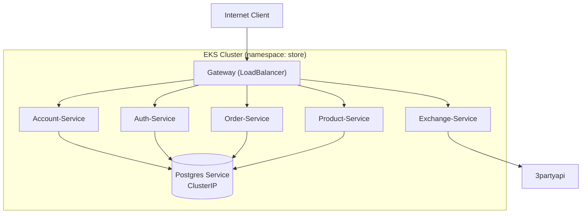

# Kubernetes Deployment

## Estrutura e Padrão de Deploy
A infraestrutura do store é organizada em múltiplos deployments e services, um para cada componente do sistema.

### 1) Banco de dados (PostgreSQL)
- Mantido em um único Deployment.
- Configuração via ConfigMap e Secret.
- Exposto internamente por ClusterIP.

### 2) Serviços de domínio
(account-service, auth-service, product-service, order-service)
- Deployments independentes.
- Cada um exposto via Service tipo ClusterIP.
- Comunicação via DNS interno do cluster (`service-name.namespace.svc.cluster.local`).

### 3) Gateway-Service
- Exposto via LoadBalancer (AWS NLB ou ALB).
- Responsável por receber tráfego externo e redirecionar requisições internas.

## Status atual no EKS

As capturas abaixo mostram o painel do EKS com os status de todos os deploys dos serviços atuais e informações de custos:


## Vídeo Demonstrativo

<video width="100%" controls>
  <source src="../assets/k8s_video.mp4" type="video/mp4">
  Your browser does not support the video tag.
</video>

## Diagrama Geral



## Localização dos manifests
Todos os arquivos de configuração do Kubernetes estão organizados por serviço, dentro da pasta `k8s` de cada módulo:

- [Account API](../account/account.md)
- [Auth API](../auth/auth.md)
- [Gateway API](../gateway/gateway.md)
- [Product API](../product/product.md)
- [Order API](../order/order.md)

## 🛠️ Deploy no Kubernetes – Comandos Utilizados
O deploy no cluster Kubernetes é feito aplicando os manifests localizados na pasta `k8s` de cada serviço dentro do diretório `api/`.

### 🗄️ 1️⃣ Banco de Dados – PostgreSQL
Executar os manifests na ordem correta:

```bash
# Secrets (credenciais de acesso)
kubectl apply -f ./k8s/secrets.yaml
kubectl get secrets

# ConfigMap (nome do banco)
kubectl apply -f ./k8s/configmap.yaml
kubectl get configmap

# Deployment e Pod
kubectl apply -f ./k8s/deployment.yaml
kubectl get deployments
kubectl get pods

# Serviço interno (ClusterIP)
kubectl apply -f ./k8s/service.yaml
kubectl get services
```

### Criar novas secrets
```bash
kubectl create secret generic auth-secrets \
  --from-literal=JWT_SECRET_KEY="sua_chave_super_secreta_aqui"
```

### 🧩 2️⃣ Todos os demais serviços
(account-service, auth-service, product-service, order-service, redis-service e gateway-service)

```bash
kubectl apply -f ./k8s/k8s.yaml
kubectl get deployments
kubectl get pods
kubectl get services
```

### Verificar os status dos serviços
```bash
kubectl get all
```
