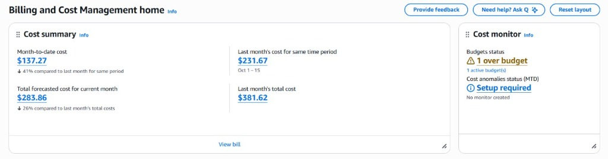
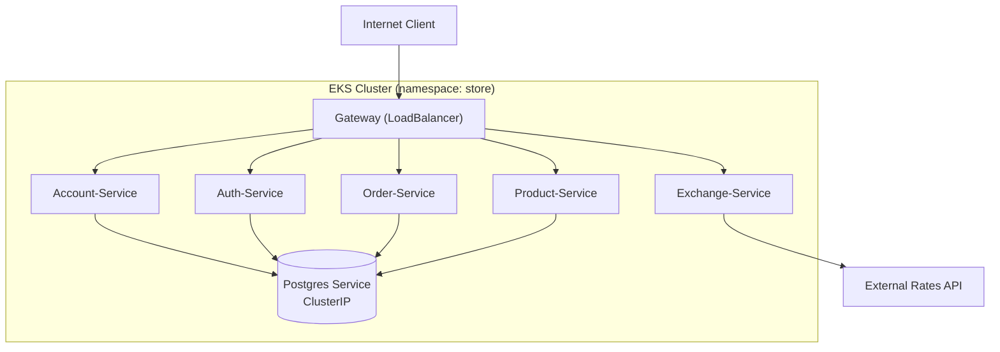

# Kubernetes Deployment

The store's infrastructure is orchestrated using **Amazon EKS (Elastic Kubernetes Service)**, ensuring high availability, scalability, and robust management of microservices.

## 🏗️ Deployment Strategy

The architecture is divided into distinct components, each with a specific deployment strategy tailored to its role.

### 1. Database (PostgreSQL)
*   **Type**: Stateful Component.
*   **Deployment**: Single replica Deployment (for this example environment).
*   **Configuration**: Managed via `ConfigMap` (non-sensitive data) and `Secret` (credentials).
*   **Exposure**: Internal `ClusterIP` service, accessible only within the cluster.

### 2. Domain Services
*(Account, Auth, Product, Order, Exchange)*
*   **Type**: Stateless Microservices.
*   **Deployment**: Independent Deployments for each service.
*   **Exposure**: Internal `ClusterIP` services.
*   **Communication**: Services communicate via internal DNS (`service-name.namespace.svc.cluster.local`).

### 3. API Gateway
*   **Type**: Edge Server.
*   **Exposure**: External `LoadBalancer` (AWS ALB/NLB).
*   **Role**: Single entry point for all external traffic, handling routing and security.

---

## 📊 Cluster Status (EKS)

The following dashboards provide real-time insights into the cluster's health and resource consumption.

### Cluster Overview


### Cost Analysis
**Summary**


**Breakdown by Service**


---

## 🎥 Deployment Demo

<video width="100%" controls>
  <source src="../assets/k8s_video.mp4" type="video/mp4">
  Your browser does not support the video tag.
</video>

---

## 🗺️ Architecture Diagram



---

## 📂 Manifest Locations

Kubernetes manifests are co-located with their respective service source code in the `k8s/` directory:

*   [Account API](../account/account.md)
*   [Auth API](../auth/auth.md)
*   [Gateway API](../gateway/gateway.md)
*   [Product API](../product/product.md)
*   [Order API](../order/order.md)

---

## 🛠️ Deployment Commands

Deployments are applied using standard `kubectl` commands.

### 1️⃣ Database Setup (PostgreSQL)
The database must be deployed first to ensure services can connect upon startup.

```bash
# 1. Apply Secrets (Credentials)
kubectl apply -f ./k8s/secrets.yaml

# 2. Apply ConfigMap (DB Name, Settings)
kubectl apply -f ./k8s/configmap.yaml

# 3. Deploy Database Pods
kubectl apply -f ./k8s/deployment.yaml

# 4. Expose Internal Service
kubectl apply -f ./k8s/service.yaml
```

**Creating Custom Secrets**
To manually create a secret (e.g., for JWT signing):
```bash
kubectl create secret generic auth-secrets \
  --from-literal=JWT_SECRET_KEY="your_super_secret_key_here"
```

### 2️⃣ Service Deployment
*(Account, Auth, Product, Order, Gateway)*

Each service follows a standard deployment pattern:

```bash
# Apply all manifests in the k8s directory
kubectl apply -f ./k8s/k8s.yaml

# Verify Status
kubectl get deployments
kubectl get pods
kubectl get services
```

### 🔍 Verification
Check the status of all resources in the namespace:

```bash
kubectl get all
```
