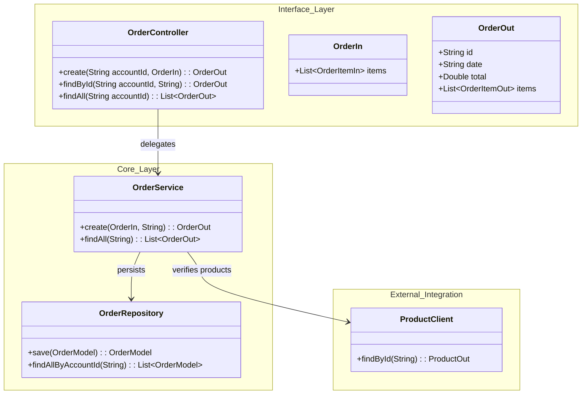

# Order Service

The **Order Service** handles the lifecycle of customer orders. It allows authenticated users to place orders, automatically validating product availability and calculating totals. It acts as an orchestrator, communicating with the **Product Service** to retrieve item details.

!!! info "Protected Resource"
    *   **User Context**: All operations require a valid user context. The Gateway injects the `id-account` header, which the service uses to link orders to the correct user.

---

## 🏗️ Architecture

The service manages a complex object graph (Orders containing Items) and integrates with external services.



---

## 🔌 API Reference

### Endpoints

| Method | Path | Description | Headers Required |
| :--- | :--- | :--- | :--- |
| `POST` | `/order` | Create a new order. | `id-account` |
| `GET` | `/order` | List all orders for the user. | `id-account` |
| `GET` | `/order/{id}` | Retrieve order details. | `id-account` |

### Data Models

#### `OrderIn` (Input)
```json
{
  "items": [
    {
      "productId": "123e4567-e89b-12d3-a456-426614174000",
      "quantity": 2
    }
  ]
}
```

#### `OrderOut` (Output)
```json
{
  "id": "789e4567-e89b-12d3-a456-426614174999",
  "date": "2025-11-29T10:00:00",
  "total": 199.98,
  "items": [
    {
      "productId": "123e4567-e89b-12d3-a456-426614174000",
      "quantity": 2,
      "total": 199.98,
      "product": { ... } // Expanded product details
    }
  ]
}
```

---

## 🧠 Business Logic

The `OrderService` orchestrates the order creation process.

### Order Creation Flow
1.  **Validate Input**: Ensures the order contains items.
2.  **Fetch Products**: Calls the **Product Service** for each item to verify existence and retrieve current prices.
3.  **Calculate Totals**:
    *   Item Total = `Product Price * Quantity`
    *   Order Total = Sum of Item Totals
4.  **Persist**: Saves the Order and its Items to the database in a single transaction.

```java
// Snippet from OrderService.java
@Transactional
public OrderOut create(OrderIn in, String idAccount) {
    // ... validation ...
    double orderTotal = 0.0;
    for (int i = 0; i < in.items().size(); i++) {
        // ... fetch product ...
        double total = product.price() * inItem.quantity();
        // ... create item model ...
        orderTotal += total;
    }
    om.setTotal(orderTotal);
    return OrderParser.toOut(orderRepository.save(om), products);
}
```

---

## 💾 Database Schema

The service uses **PostgreSQL** with a dedicated schema (`"order"`). Note the quoted schema name to avoid conflict with the SQL keyword `ORDER`.

### Table: `orders`
| Column | Type | Description |
| :--- | :--- | :--- |
| `id` | `VARCHAR` | Primary Key. |
| `date` | `TIMESTAMP` | Order creation date. |
| `account_id` | `VARCHAR` | ID of the user who placed the order. |
| `total` | `DOUBLE` | Total value of the order. |

### Table: `item`
| Column | Type | Description |
| :--- | :--- | :--- |
| `id` | `VARCHAR` | Primary Key. |
| `order_id` | `VARCHAR` | Foreign Key to `orders`. |
| `product_id` | `VARCHAR` | ID of the product. |
| `quantity` | `INTEGER` | Quantity purchased. |
| `total` | `DOUBLE` | Total price for this line item. |

---

## ⚙️ Configuration

The service is configured via `application.yml`.

```yaml
spring:
  application:
    name: order
  datasource:
    url: ${DATABASE_URL}
  jpa:
    properties:
      hibernate:
        default_schema: order # Explicit schema definition
```

---

## 📂 Project Structure

The project is split into two modules:

1.  **Interface (`order`)**: Contains DTOs and Feign Client.
2.  **Implementation (`order.service`)**: The Spring Boot application.

```tree
api/
├── order/                  # Interface Module
│   ├── src/main/java/store/order/
│   │   ├── OrderController.java    # Feign Client
│   │   ├── OrderIn.java            # DTO
│   │   └── OrderOut.java           # DTO
│   └── pom.xml
│
└── order.service/          # Implementation Module
    ├── src/main/java/store/order/
    │   ├── OrderService.java       # Business Logic
    │   ├── OrderResource.java      # REST Controller
    │   ├── OrderRepository.java    # JPA Repository
    │   └── OrderModel.java         # JPA Entity
    ├── src/main/resources/
    │   ├── db/migration/           # Flyway Scripts
    │   └── application.yml         # Config
    ├── Dockerfile
    └── k8s/                        # Kubernetes Manifests
```