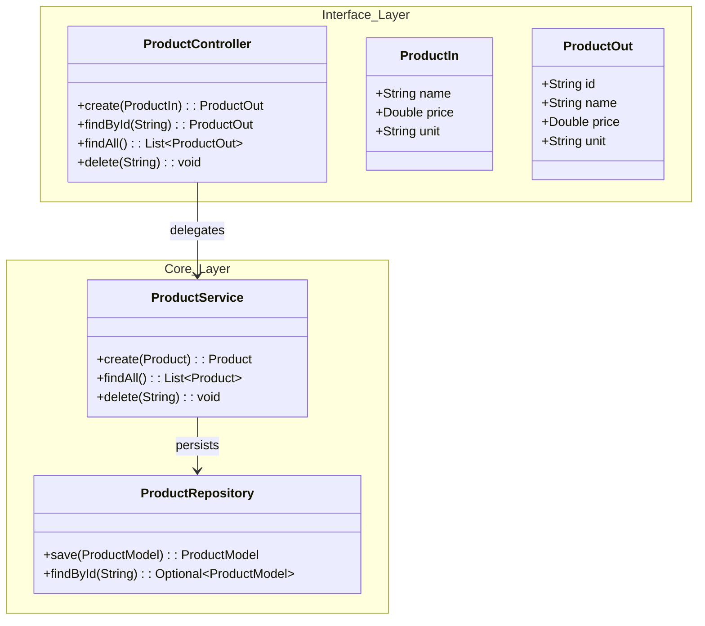

# Product Service

The **Product Service** manages the catalog of items available in the store. It provides a CRUD (Create, Read, Update, Delete) interface for managing product details such as name, price, and unit.

!!! info "Protected Resource"
    *   **Access Control**: All modification endpoints (POST, DELETE) require authentication.
    *   **Public Access**: Read-only endpoints (GET) are generally accessible but may be restricted by the Gateway configuration.

---

## 🏗️ Architecture

The service follows a standard layered architecture with a clean separation between the API contract and the persistence layer.



---

## 🔌 API Reference

### Endpoints

| Method | Path | Description |
| :--- | :--- | :--- |
| `POST` | `/product` | Create a new product. |
| `GET` | `/product` | List all products. |
| `GET` | `/product/{id}` | Retrieve product details. |
| `GET` | `/product/search/{name}` | Search products by name. |
| `DELETE` | `/product/{id}` | Delete a product. |

### Data Models

#### `ProductIn` (Input)
```json
{
  "name": "Smartphone X",
  "price": 999.99,
  "unit": "un"
}
```

#### `ProductOut` (Output)
```json
{
  "id": "123e4567-e89b-12d3-a456-426614174000",
  "name": "Smartphone X",
  "price": 999.99,
  "unit": "un"
}
```

---

## 🧠 Business Logic

The `ProductService` enforces data integrity rules before persistence.

### Validation Rules
*   **Name**: Mandatory and must be unique. Special characters are trimmed.
*   **Price**: Mandatory.
*   **Unit**: Mandatory.

```java
// Snippet from ProductService.java
public Product create(Product product) {
    if (null == product.name()) {
        throw new ResponseStatusException(HttpStatus.BAD_REQUEST, "Name is mandatory!");
    }
    // Check for duplicates
    if (productRepository.findByName(product.name()).isPresent()) {
        throw new ResponseStatusException(HttpStatus.BAD_REQUEST, "Name already have been registered!");
    }
    // ...
}
```

---

## 💾 Database Schema

The service uses **PostgreSQL** for persistence, managed by **Flyway**.

### Table: `product`

| Column | Type | Constraints | Description |
| :--- | :--- | :--- | :--- |
| `id` | `VARCHAR` | `PRIMARY KEY` | Unique UUID. |
| `name` | `VARCHAR` | `NOT NULL` | Product name. |
| `price` | `DOUBLE` | `NOT NULL` | Product price. |
| `unit` | `VARCHAR` | `NOT NULL` | Unit of measurement (e.g., 'kg', 'un'). |

### Migrations
*   `V2025.08.29.001__create_schema.sql`: Initializes the schema.
*   `V2025.08.29.002__create_table_product.sql`: Creates the product table.

---

## ⚙️ Configuration

The service is configured via `application.yml`.

```yaml
spring:
  application:
    name: product
  datasource:
    url: ${DATABASE_URL}
    username: ${DATABASE_USERNAME}
    password: ${DATABASE_PASSWORD}
  flyway:
    schemas: product
```

---

## 📂 Project Structure

The project is split into two modules:

1.  **Interface (`product`)**: Contains DTOs and Feign Client.
2.  **Implementation (`product.service`)**: The Spring Boot application.

```tree
api/
├── product/                # Interface Module
│   ├── src/main/java/store/product/
│   │   ├── ProductController.java  # Feign Client
│   │   ├── ProductIn.java          # Input DTO
│   │   └── ProductOut.java         # Output DTO
│   └── pom.xml
│
└── product.service/        # Implementation Module
    ├── src/main/java/store/product/
    │   ├── ProductService.java     # Business Logic
    │   ├── ProductResource.java    # REST Controller
    │   └── ProductRepository.java  # JPA Repository
    ├── src/main/resources/
    │   ├── db/migration/           # Flyway Scripts
    │   └── application.yml         # Config
    ├── Dockerfile
    └── k8s/                        # Kubernetes Manifests
```